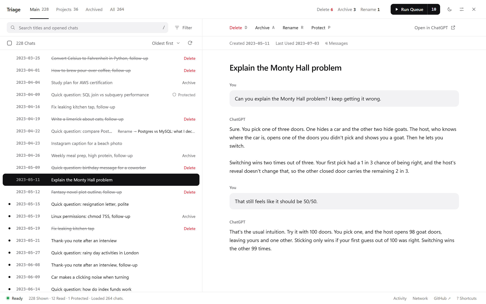
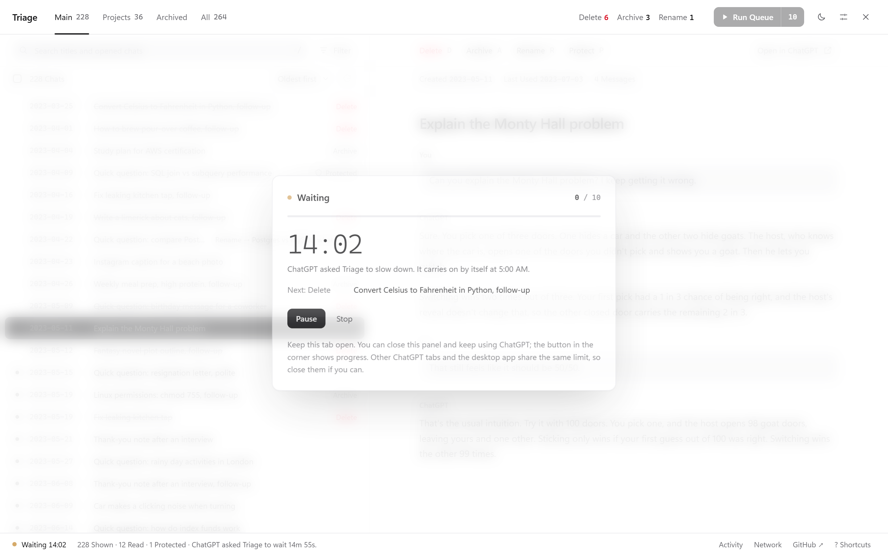
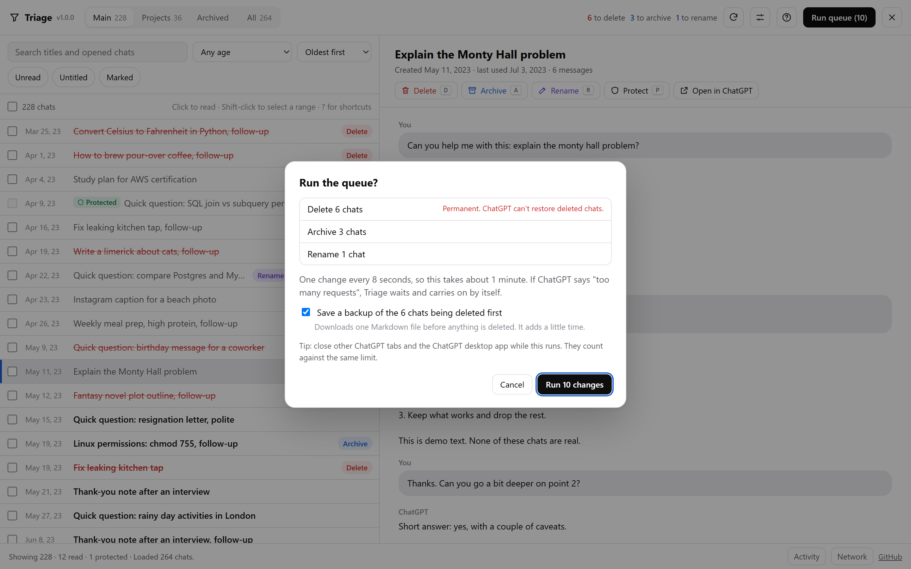

# Triage

**Read every chat before you decide. Queue deletes, archives and renames, and let them run at a pace ChatGPT tolerates.**

ChatGPT has no way to select several chats at once. Deleting hundreds of them one by one is slow, and doing it quickly gets you this:

> Too many requests. You're making requests too quickly. We've temporarily limited access to your conversations to protect your data.

Triage is a free userscript that adds a cleanup workspace to chatgpt.com. You go through your chats oldest first, read each one in a side panel, and mark it: delete, archive, rename or protect. Nothing changes until you press **Run Queue**. Then Triage works through the queue one change at a time. When ChatGPT says "too many requests", it stops, waits as long as ChatGPT asks, and carries on by itself.



<p align="center"><a href="https://nasircissistic.github.io/chatgpt-triage/demo/"><b>Try the demo</b></a> (a fake ChatGPT account, nothing real is touched) · <a href="#install">Install</a> · <a href="#how-it-stays-under-chatgpts-limit">How it handles the limit</a></p>

## What it does

- **Read before you decide.** Click a chat, or move with the arrow keys, and the whole conversation opens next to the list. No new tabs.
- **One queue for everything.** Delete, archive, unarchive and rename, marked with a click or a single key (`D`, `A`, `R`). Rename is handy for all those chats called "New chat".
- **Protect what matters.** Press `P` and a chat can never be queued, even by select all.
- **Project chats stay out of the way.** The main list leaves out chats that live in Projects, so a cleanup can't empty a project by accident. They have their own tab when you want them.
- **Pick up where you left off.** Marks, protected chats and the chats you've already read are saved in your browser. Close the tab, reload, come back next week: it's all still there. A run that was interrupted resumes from the same chat.
- **Built for big cleanups.** A Filter menu for unread, untitled and marked chats and for age, three sort orders, search, shift-click ranges, select all and invert.
- **A backup before deleting.** Before a delete run, Triage can save every chat about to be deleted to a Markdown file.
- **Checks its own work.** At the end of a run, Triage reloads your list and flags anything that didn't actually go.
- **Light or dark.** Triage matches ChatGPT's theme, or switch it yourself with the sun and moon button. The new theme spreads out in a circle from the button you pressed.

## How it stays under ChatGPT's limit

Deleting chats in ChatGPT's own sidebar sets off a burst of extra requests to reload the chat list, and that list is what ChatGPT locks when there are too many requests ([details on the OpenAI forum](https://community.openai.com/t/chatgpt-web-conversation-history-returns-persistent-429-rate-limit-and-fails-to-load/1391615)). Triage avoids the burst:

- **One change at a time**, with 8 seconds between changes by default. You can change the gap in Settings (3 seconds minimum).
- **Every request is spaced out**, including loading your list and reading chats.
- **When ChatGPT says "too many requests"**, Triage stops sending anything. It waits exactly as long as ChatGPT asks. If ChatGPT doesn't say, it waits 2 minutes, then 5, 15 and 30 if it happens again. Then it retries the same chat and carries on.
- **If your sign-in expires mid-run**, it refreshes it once and continues. If that fails, it pauses and tells you.
- **Pause and Stop** work at any point. Stopping never loses marks for chats it didn't reach.



## Install

### As a userscript (recommended)

1. Install a userscript manager: [Tampermonkey](https://www.tampermonkey.net/) (Chrome, Edge, Firefox, Safari) or [Violentmonkey](https://violentmonkey.github.io/).
2. **Chrome and Edge only:** userscript managers need one extra switch. Open your browser's extensions page and turn on **Developer mode**, or open Tampermonkey's **Details** and turn on **Allow User Scripts**, whichever your browser shows. Tampermonkey tells you if it's needed.
3. Open **[chatgpt-triage.user.js](https://raw.githubusercontent.com/NASIRCISSISTIC/chatgpt-triage/main/chatgpt-triage.user.js)**. Your userscript manager shows an install page. Click **Install**.
4. Go to [chatgpt.com](https://chatgpt.com). A **Triage** button appears in the bottom-right corner. You can also press `Alt` + `Shift` + `T`.

Updates install themselves through your userscript manager.

### Without installing anything

1. Open [chatgpt.com](https://chatgpt.com) and sign in.
2. Open the browser console: `F12` (or `Ctrl` + `Shift` + `J`, `Cmd` + `Option` + `J` on a Mac), then the **Console** tab.
3. If the console asks, type `allow pasting` and press Enter.
4. Paste the whole contents of [chatgpt-triage.user.js](chatgpt-triage.user.js) and press Enter.

You'll need to paste it again after reloading the page. Only paste code you've read or trust; this file is one readable script with no hidden parts.

## Using it

1. **Read and mark.** Go down the list. The chat opens on the right. Mark it or skip it.
2. **Check the queue.** The top bar shows what's queued. **Filter → Marked** shows only chats with a change waiting.
3. **Run it.** Press **Run Queue**, check the summary, and confirm. The summary lists every chat that's about to change, with deletions first. Deleting 20 or more chats asks you to type the number. You can close the panel while it runs; the corner button shows progress.



| Key | Does |
| --- | --- |
| `↑` `↓` or `J` `K` | Move through the list; the chat opens on the right |
| `Shift` + `↑` `↓` | Select as you move |
| `Space` or `X` | Select or unselect |
| `D` | Queue delete, then move on |
| `A` | Queue archive (unarchive in the Archived tab) |
| `R` | Queue a new name |
| `P` | Protect or unprotect |
| `C` | Clear the queued change |
| `/` | Search |
| `Esc` | Clear the selection, or close a menu or dialog |
| `?` | All shortcuts (also **? Shortcuts** at the bottom right) |
| `Alt` + `Shift` + `T` | Open or close Triage |

## Privacy

- Triage runs entirely in your browser. The only server it talks to is chatgpt.com, using your existing sign-in.
- No analytics, no accounts, no server of its own, no remote code. The whole thing is [one file](chatgpt-triage.user.js).
- Your marks and settings are stored in your browser's local storage for chatgpt.com, separately for each ChatGPT account.
- The **Network** button at the bottom lists every request Triage has sent. Your sign-in token is never shown or saved.

## Good to know

- **Deleting is permanent.** OpenAI [can't restore deleted chats](https://help.openai.com/en/articles/8809935-deleting-and-archiving-chats-in-chatgpt), not even through support. If you're unsure, archive instead; you can unarchive later. Turn on the backup when you delete.
- **Unofficial.** Triage uses ChatGPT's private web API, the same one chatgpt.com uses. OpenAI can change it at any time. Triage checks the data it gets back and switches changes off if it looks unfamiliar.
- **Personal accounts.** Triage is built for personal ChatGPT accounts. Team, Business and Enterprise workspaces haven't been tested.
- **ChatGPT's list can lag.** After an archive or unarchive, ChatGPT's own chat list can take several minutes to catch up, even though the chat itself changed straight away. Triage asks about the chat itself before calling a change failed.
- **One tab at a time.** Run the queue from one tab. Other ChatGPT tabs and the desktop app share the same request limit, so close them during a long run.
- **Full-text search is deliberately limited.** Search covers every title and the text of chats you've opened. Downloading every chat just to search it would set off the very limit Triage is built to avoid.

## Demo and development

The [`demo/`](demo) folder is a stand-in for chatgpt.com with a fake account of about 280 made-up chats. [`demo/mock-api.js`](demo/mock-api.js) answers the same requests ChatGPT does, inside the page, and can simulate the hard cases:

| Add to the demo URL | Simulates |
| --- | --- |
| `?ratelimit=on&max=6&window=30` | "Too many requests" after 6 requests in 30 seconds, with a Retry-After header. Like every wait in the demo, it runs at the demo's speed. |
| `?ratelimit=noheader` | The same, without saying how long to wait |
| `?expire=30` | Sign-in tokens that expire every 30 seconds |
| `?fail=0.2` | 20% of changes failing with a server error |
| `?ghost=0.3` | 30% of changes reporting success without taking effect |
| `?listlag=20` | The chat list still showing archived and deleted chats for 20 seconds, as chatgpt.com does |
| `?chats=3000` | A bigger account, to try Triage on a long history |
| `?speed=50` | Every wait, including ChatGPT's, runs 50 times faster. The demo defaults to 4× and says so in its footer; `?speed=1` runs at real speed. |

To run it locally, serve the folder and open the demo:

```bash
python -m http.server 8000
```

Then visit `http://localhost:8000/demo/`.

## Contributing

Bug reports and ideas are welcome in [Issues](https://github.com/NASIRCISSISTIC/chatgpt-triage/issues). If ChatGPT changes something and Triage stops working, an issue with what the **Network** panel shows helps most. Leave out anything private.

## License

[MIT](LICENSE) © Nasir Yar Khan ([@NASIRCISSISTIC](https://x.com/NASIRCISSISTIC)).

Triage is an independent project. It isn't affiliated with, endorsed by, or sponsored by OpenAI. ChatGPT is a trademark of OpenAI.
